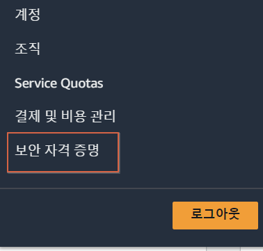
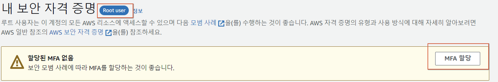
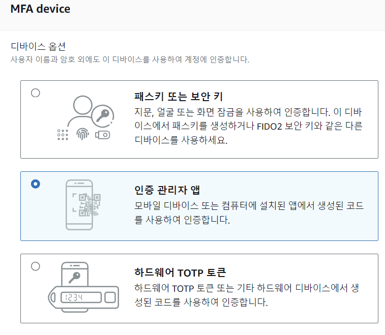

#### AWS에서 billing은 루트계정이 관리할 것이기 때문에 보안이 가장 중요함 ! 따라서 MFA를 적용하는게 필수

# 실습

1. 루트계정에서 보안자격증명을 선택
   

2. MFA 할당클릭
   

3. 인증앱
   

4. Twillo Authy로 MFA사용했음
   https://apps.apple.com/us/app/twilio-authy/id494168017
   QR스캔해서 계정생성

5. 루트계정 로그인시마다 비밀번호 + MFA 추가 인증
