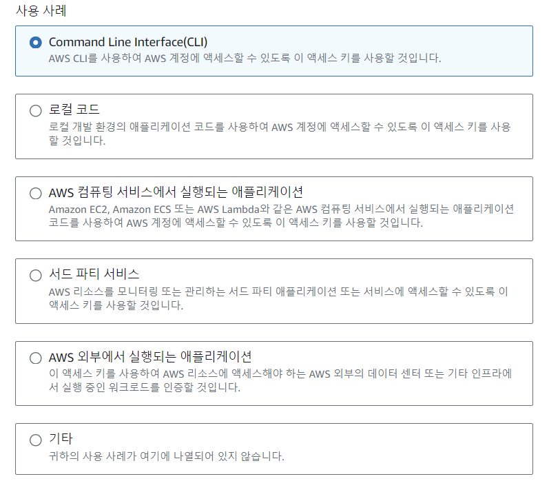

# AWS CLI 설정

1. AWS CLI download 구글링
2. 2024 현재 시점으로는, 아래 사이트 들어가서 AWS CLI MSI 설치
   https://docs.aws.amazon.com/cli/latest/userguide/getting-started-install.html
3. 다운로드하고 cmd창에서 aws --version 입력해서 버전정보 제대로 나오면 AWS CLI 설정완료
4. 만약 AWS CLI 를 업그레이드 하고 싶다면, 인스톨러를 새로 설치해야함

# 액세스키 만들기

1.  IAM -> 사용자 -> 사용자클릭 -> 보안자격증명(Credential Security) -> 액세스키

- 해당하는 사례 체크  

2. 액세스키는 처음 만들어질때 한번만 보여짐, 저장 잘 해두기

# AWS CLI 사용

1. cmd 창에서 aws configure 입력

- 액세스키, 시크릿액세스키,리전이름 설정

## AWS CLI 기본 명령어

- aws iam list-users
- iam의 모든 유저들을 보여줌, 만약 사용자가 admin권한이 없다면 access denied 됨
