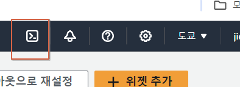
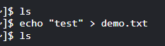
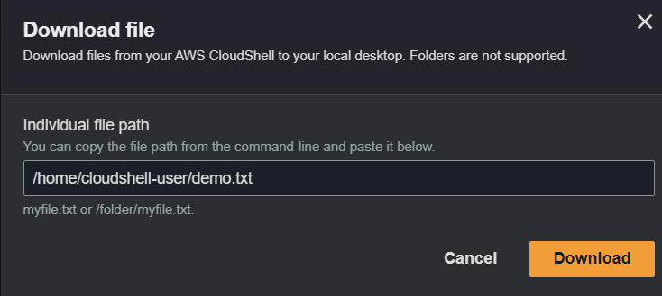

# AWS Cloud Shell

- 브라우저 기반의 가상 셸 (CLI 터미널의 대안)
- AWS 클라우드에서 쓸수 있는 터미널
- 메뉴란 맨 위에 있음
  
- Cloud Shell 이 가능한 리전은(가용성:availability) 한정되있음. 한국에는 아직 없어서 리전 도쿄로 설정
- AWS CLI에서는 API 요청시 --리전 으로 리전을 설정할 수 있지만, AWS Cloud Shell에서는 현재 로그인한 리전으로 기본 리전이 설정됨
- Cloud Shell 에는 Repository가 있기때문에 파일을 만들수 있음
  - 아래의 명령어로 demo.txt 출력됨!
  - 
  - 로그인을 다시 하여도, 위의 demo.txt는 남아있게 됨
- pwd로 현재 경로를 알아낸 후 , 설정의 download file을 하면, 해당 경로의 파일을 다운로드 할 수 있다.
  - 
