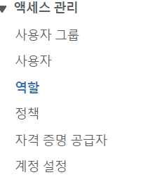
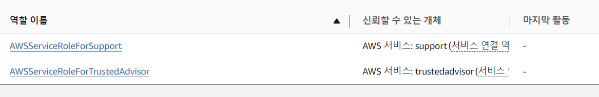

# IAM Role

- IAM Role은 사용자와 같지만 실제 사람이 사용하도록 만들어진 것이 아니고 AWS서비스에 의해 사용하도록 만들어짐

  - EC2 인스턴스(가상서버)를 만든다면, EC2 인스턴스는 AWS에서 어떤 작업을 수행하려고 할 수 있음. 이를 위해서는 EC2 인스턴스에 권한을 부여해야함. 이를 위해 IAM Role을 만들어서 이들을 하나의 개체로 만듦
  - EC2 인스턴스가 AWS에 있는 어떤 정보에 접근하려고 할 때 IAM Role을 사용하려 할것임

- Common Roles :
  - EC2 Instance Roles
  - Lambda Function Roles
  - Roles for CloudFormation

# 실습

1. 엑세스 관리의 역할 클릭

2. 사용하는 계정에 따라 Role이 여러개 나옴, Role은 AWS에서 개체(entitity)가 잠깐동안 자격(credential)을 받고 필요한 일을 할 수 있게 해줌
   

3. 역할생성 버튼을 클릭해서 Role 을 만들 수 있음
   - 실습에서는 EC2 서비스에 대한 Role을 만들었음
