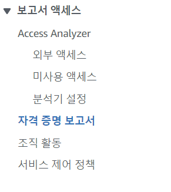
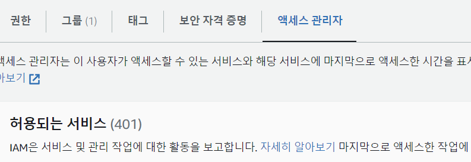
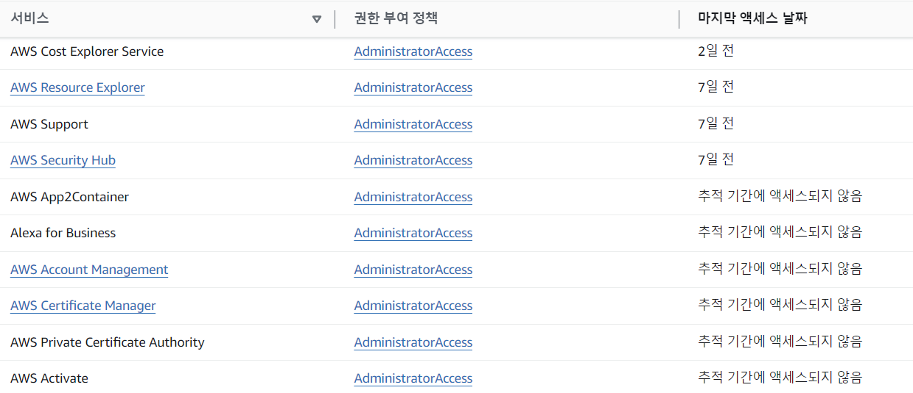

# IAM Security Tools

- IAM Credentials Report (Account - Level)

  - 계정의 모든 유저와 유저들의 개별적인 자격들을 볼 수 있음

- IAM Access Advisor (User - Level)
  - 유저에게 부여된 서비스 권한과 가장 마지막으로 서비스에 접속한 시간이 보임
  - 따라서 유저에게 부여된 권한 중 어떠한 권한이 필요없는지를 확인할 수 있고, 따라서 사용자의 권한을 줄여 최소 권한(least-privilege)의 원칙을 지킬 수 있음

# 실습

### IAM Credentials Report

1.  보고서 엑세스 -> 자격 증명 보고서 클릭

2. 보안인증보고서 (csv 파일)을 다운받음

- 엑셀파일로된 정보에서 계정의 유저들에 대한 자격 정보(MFA, Password 등등) 를 볼수있음

### IAM Access Advisor

1. 액세스관리 -> 사용자

2. 원하는 사용자 클릭후 , 엑세스 관리자를 볼 수 있음 .
   

3. 해당 유저에게 부여된 권한 + 마지막 서비스 접속시간 확인 가능
   

   - 오랫동안 액세스되지 않은 서비스가 있다면 제거하는게 바람직함 (least-privilege)
