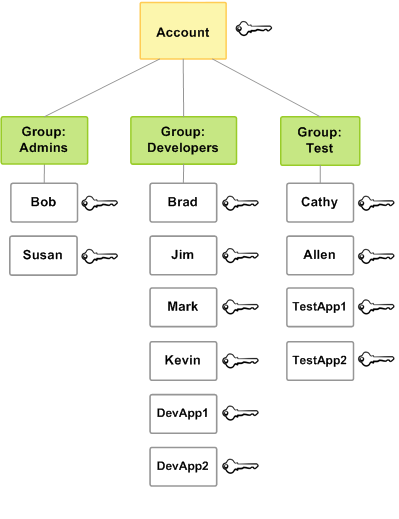

1. IAM 역할의 올바른 정의

- 정답 : AWS 서비스에 요청을 생성하기 위한 일련의 권한을 정의하고, AWS 서비스에 의해 사용될 IAM 개체

- 해석 : 일부 AWS 서비스는 특정 행동을 수행해야함. IAM 역할(Role)은 이러한 권한을 할당하기 위해 사용됨

2. IAM 보안도구

- 정답 : IAM 자격 증명 보고서

- 해석 : IAM 자격 증명 보고서에는 AWS 계정의 모든 IAM 사용자와 이들의 다양한 자격증명 상태가 포함되있음 (csv 파일)

3. IAM 사용자에 대해 잘못 서술된 것

- 정답 : IAM 사용자들은 루트 계정 자격 증명을 통해 AWS 서비스에 액세스 합니다

- 잘못된 이유 : IAM 사용자들은 각각 자신만의 자격증명(사용자 이름 & 비밀번호, 혹은 액세스키)를 통해 AWS 서비스에 액세스함

4. IAM 모범 사례

- 정답 : 루트계정 사용하지 않기

- 해석 : 루트계정은 최초 IAM 사용자 생성과 일부 계정/서비스 관리 업무에만 사용됨. 일상적인 업무에는 IAM 사용자를 사용

5. IAM 정책

- 정답 : AWS 서비스에 요청을 생성하기 위한 일련의 권한을 정의하며, IAM 사용자, 사용자 그룹 및 IAM Role에서 사용하게 될 JSON 문서

6. IAM 권한

- 정답 : 최소 권한 부여하기 (least-privilege)

7. 루트 계정 보안을 향상시키기 위한 작업

- 정답 : 다중인증(MFA) 활성화하기

8. (오답) IAM 사용자 그룹은 IAM 사용자 및 기타 사용자 그룹을 포함할 수 있습니다

- 정답 : FALSE
- 해석 : IAM 사용자 그룹은 다른 사용자 그룹에 속할 수 없다.사용자만 중복으로 속할 수 있음

  - 한 사용자 그룹에 여러 사용자가 포함될 수 있으며 한 사용자가 다중 사용자 그룹에 속할 수 있음
  - 사용자 그룹은 중첩될 수 없음. 즉, 사용자 그룹은 사용자만 포함할 수 있으며 다른 그룹은 포함할 수 없음
  - AWS 계정의 모든 사용자를 자동으로 포함하는 기본 사용자 그룹은 없음. 이러한 사용자 그룹이 필요한 경우 하나 만들어 새로운 사용자를 각각 해당 그룹에 할당해야함
  - 그룹 수, 사용자가 맴버가 될 수 있는 그룹 수와 같이 AWS계정에 있는 IAM 리소스의 수와 크기는 제한되있음

  - 회사 소유주가 ADmins사용자 그룹을 생성해, admins에 있는 사용자들이 다른 사용자들을 생성하고 관리함

9. IAM 정책은 하나 이상의 문장(statement)으로 구성됨 . IAM 정책 내 문장(statement)의 구성요소가 아닌것

- statement: 효과(effect) , 원칙(principal), 조치(Action) , 리소스(Recourse)

- 정답 : 버전(version)
- 해석 : IAM 정책 자체의 일부이지, 문장(statement)의 일부가 아님
