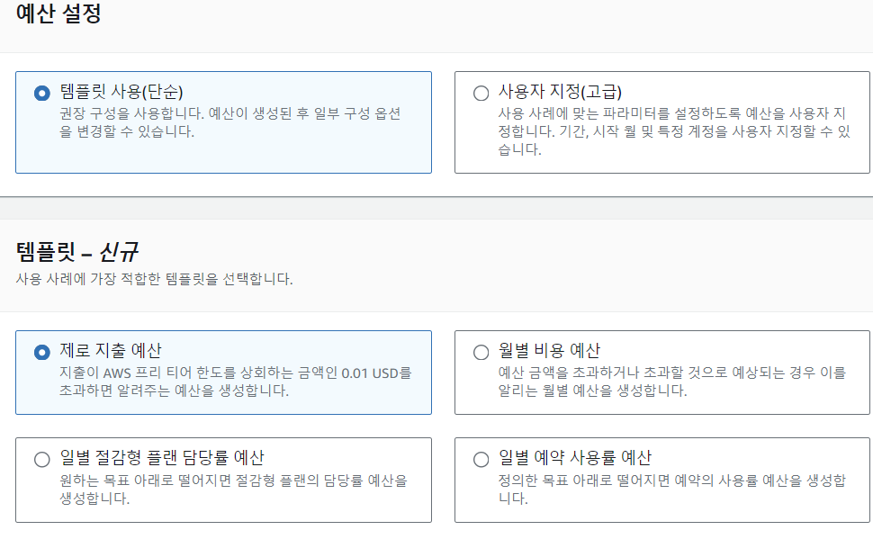
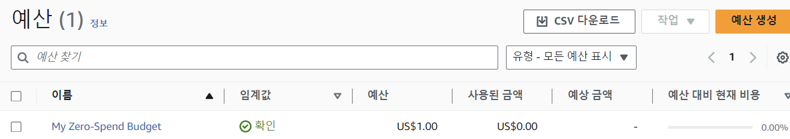

## 예산디버깅

### 예산 임계정 설정

- 결제 및 비용관리 -> Budget(예산) 탭에서 예산설정
  - 프리티어로 실습할거라서 , 0.01 버젯을 넘어가면 이메일이 오도록 설정
    
  - 비용 수신받을 이메일을 작성하면 완료.
    

### 비용이 발생되고 있다면

- 결제 및 비용관리 -> 청구서 -> 계정별 요금으로 비용을 분석
  - 프리티어를 사용하고 있다면 프리티어 탭에서 확인 (비용 청구되는 서비스를 끄기)
