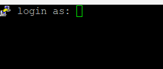
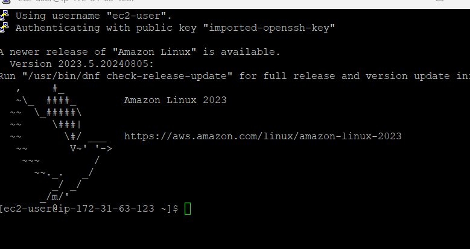
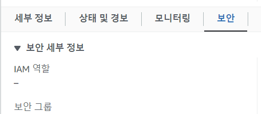
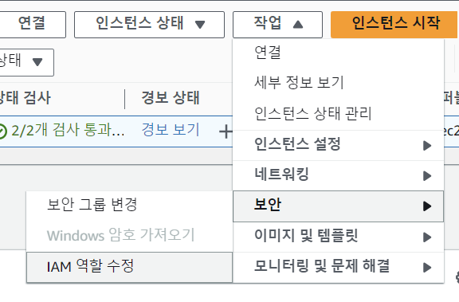
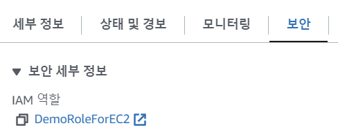

### SSH Summary

- 맥,리눅스,윈도우10 이상 버전에서는 SSH로 로그인이 바로 가능함
- 윈도우10 이하 버전에서는 SSH로그인이 바로 안되기 때문에 putty로 SSH로그인을 함
- 위의 방법이 아니라 Amazon Linux2를 이용해 브라우저에서 GUI로 바로 쓰는 방법도 있음 (EC2 Instance Connect)

### How to SSH into your EC2 Instance (window)

- SSH는 command line을 이용해서 원격머신(원격서버)를 조정할 수 있도록 해줌. 그 이상..그 이하도 아님 !
- 필자는 윈도우라서 putty로 실습했음
- putty를 다운로드하면 putty + puttyGen 이 다운로드됨

### putty를 이용해 ssh 로그인

1. 키페어를 ppk형식으로 바꾸기 위해 puttyGen 설정
   - puttyGen에가서 키페어(pem)을 넣고 save private key로 저장함
   - ppk 포맷형식으로 재저장
2. EC2 인스턴스에 접근하기 위해 putty 설정
   
   - hostName에 접근하려는 인스턴스 IP주소
   - Connection type은 SSH
   - open을 클릭하면 경고창이 나오는데 호스트를 신뢰하는 경우라면 accept
   - accept가 되어도, 키가 없으면 로그인이 안됨
   - 
   - 따라서 putty로 다시 hostname의 ip에 ec2-user@ip주소를 앞에 추가해줌 (ec2-user는 amazon linux2에서 미리 설정한 사용자)
   - auth 로 가서 private key file for authentication에 프라이빗키 파일을 넣음(puttyGen으로 생성한 ppk파일)
   - session으로 다시 돌아가서 save누르고 open하면 콘솔이 정상적으로 보임
     

### EC2 인스턴스 커넥트 (브라우저에서 바로 커넥트)

- 인스턴스 - 연결 -> command line이 바로 보임
  
- 세션이 브라우저 안에 있어서 SSH 유틸리티를 사용하지 않아도 연결가능
- EC2 인스턴스 커넥트시에는 access key를 사용하면 안됨
  - 다시 EC2 인스턴스 커넥트할 떄 이전 정보들을 회수 할 수 있음

### IAM Role의 정책을 EC2 인스턴스에 연결

- 현재 EC2 인스턴스에는 IAM Role이 없는 상태
  
- 인스턴스 - 작업 - 보안 - IAM 역할 수정으로 변경
  
  - 추가하면 다음과 같이 IAM Role에 역할이 추가됨
    
