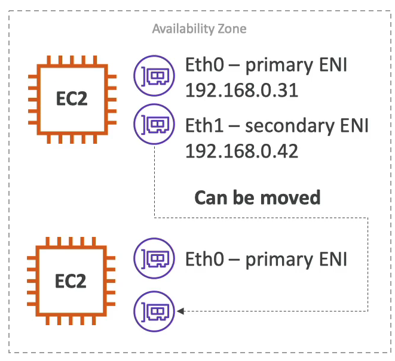

## Elastic Network Interfaces (ENI) 탄력적 네트워크 인터페이스

- VPC의 논리적 구성요소이며, 가상네트워크 카드를 나타냄
- Primary private IPv4 (주요 사설 IPv4) 와 하나 이상의 보조 IPv4를 가질 수 있음
- private IPv4당 하나의 Elastic IP를 가질 수 있음
- 하나의 공용 IPv4를 가질 수 있음
- MAC 주소를 가질 수 있음
- 하나 이상의 보안 그룹을 연결할 수 있음
- EC2 인스턴스와 독립적으로 ENI를 생성하고 즉시 연결하거나 , 실패 조치를 위해 EC2 인스턴스에서 이동시킬 수 있음
- 
  - 첫번째 인스턴스에 문제가 생길 때 Eth1을 옮겨서 사설 IP를 이동시킬 수 있음
- 특정 가용영역 즉 AZ에 바인딩됨
  - 특정 AZ에서 ENI를 생성하면, 해당 AZ에만 바인딩할 수 있음
