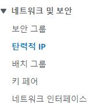
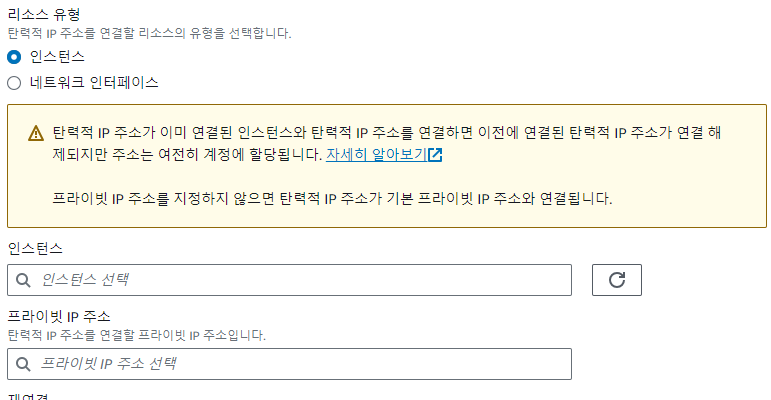

## Elastic IP 실습

- Putty로 public IP로 로그인 후, 로그아웃하고 다시 Private IP로 로그인하려고 하였으나, 연결되지 않았음
  - Private IPv4는 사설망에 속하기 때문임. 현재로는 AWS 사설망에 연결되있지 않음(인터넷을 통해서만 연결중임)
- EC2 인스턴스를 중지하고 다시 시작하면, public IP주소는 바뀜. (but private IP주소는 그대로 ~)
- 만약 EC 인스턴스의 public IPv4 주소를 그대로 유지하고 싶다면, Elastic IP를 설정해야함
-  현재 설정하지 않은 상태
- 네트워크 보안 -> 탄력적 IP -> 탄력적 주소할당 -> 탄력적 IP주소 할당
- 
- 
- 인스턴스로 가서 elastic IP를 보면 public IPv4랑 Elastic IPv4랑 같아진 것을 확인할 수 있음
- elastic IP 중지시 disassociate -> realase elastic IP 까지 하기 !
