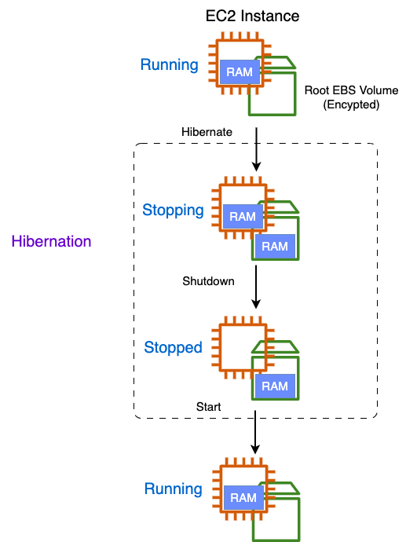

## EC2 Hibernate(절전모드)

- 일단 Hibernate의 실제 뜻은 "겨울잠을 자다", "동면하다"의 뜻이 있음. 자바에서는 DB를 자바 프로그램 내에서 객체처럼 사용할 수가 있음 . 따라서 SQL을 작성하지 않아도 자바로만 DB작업이 가능해짐. 동작을 잠자는 것처럼..(?) 쉬워지게 하는 뉘앙스가 있는 듯함. 컴퓨터에서도 Hibernate이라는 용어를 사용 전원함. 이는 전원이 꺼질 때 현재 작업하고 있던 모든 것들을 하드웨어에 저장하고 전원이 꺼지는 상태를 말한다고 함.
- In-memory(RAM) 상태가 보존됨
- 인스턴스를 중지하고 다시 시작해도, RAM에 있는 데이터가 빠르게 로딩됨
- 인스턴스 부팅이 훨씬 빠름
- Under the hood : the RAM state is written to a file in the root EBS volumn
- Use Cases :

  - Long-running processing
  - Saving the RAM state
  - Services that take time to initialize

  - 
  - 사진과 같이 인스턴스가 중지되도 RAM은 계속 보전됨
  - 60일 이상 사용할 수 없음
  - On-Demand,Reserved,Spot 인스턴스만 가능
