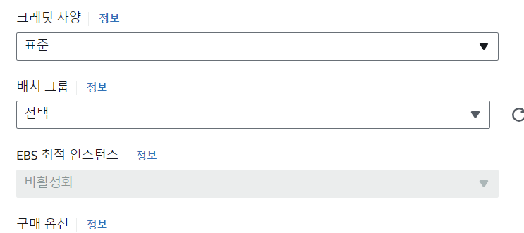

Pictures from https://dev.to/ukemzyskywalker/decoding-ec2-placement-groups-unveiling-the-pros-and-cons-of-cluster-spread-partition-strategies-and-its-implementation-22fe

## 배치그룹

- EC2 인스턴스를 배치를 통해 조절하는 것
- 배치그룹 전략에는 다음과 같은 그룹이 있음

  - Cluster(클러스터) : 단일 가용 영역 내에서 지연 시간이 짧은(low-latency) 하드웨어 설정으로 인스턴스를 그룹화 , 높은 성능을 제공 But 위험성
  - Spread(분산) : 분산 배치그룹은 인스턴스가 여러개의 다른 하드웨어에 배치된다는 뜻. 가용 영역별로 분산된 배치그룹당 7개의 인스턴스만 가질 수 있음
    - 크리티컬 어플리케이션(비지니스적으로 중요한 어플리케이션)
  - Partition(분할) : 분산 배치그룹과 마찬가지로 인스턴스를 분산하는 것이지만, 가용 영역 내의 다양한 하드웨어 랙세트에 의존함 (인스턴스가 여전히 분산되어있지만, 다른 실패로부터 격리되지 않음 but 파티션은 다른 오류 파티션과 격리되야함)
    - 그룹당 수백개의 인스턴스를 통해 확장할 수 있고 Hadoop,Kafka 같은 어플리케이션을 실행할 수 있음

## Placement Groups : Cluster

- 
- Pros : Low-Latency(빠름)
- Cons : AZ fails, all instances fail at the same time
- Use case : Big Data job that needs to complet fast , Application that needs low-latency

## Placement Groups : Spread

- 
- 각각의 다른 하드웨어에 위치해있음
- Pros : Can span across Availability Zones(AZ) , Reduced risk is simultaneous failure (하드웨어1이 망가져도 하드웨어2에 있는 인스턴스는 계속 운영됨)
- Cons : Limited to 7 instances per AZ per placement group
- Use Case : Application that needs to maximize high availablity , Critical applications where each instance must be isolated from failure from each other

## Placement Groups : Partition

- 
- 여러 가용 영역의 파티션에 인스턴스를 분산할 수 있음
- 가용 영역당 최대 7개의 파티션
- 각각의 파티션당 여러개의 인스턴스를 가질 수 있음 ( 수백개 )
- 랙(rack)을 공유하지 않기 때문에 하나의 파티션이 실패해도 다른 파티션에 있는 인스턴스에는 영향을 주지 않음
- EC2 인스턴스는 metadata라는 곳에서 파티션 정보를 볼 수 있음
- Use cases : HDFS, HBase, Cassandra, Kafka (주로 빅데이터 관련)

## 실습

- 배치그룹 -> 배치그룹 생성하기로 만들 수 있음
- 
- 배치그룹 생성 후, 인스턴스 만들때 고급 세부 정보에서 배치그룹 설정 가능
- 
